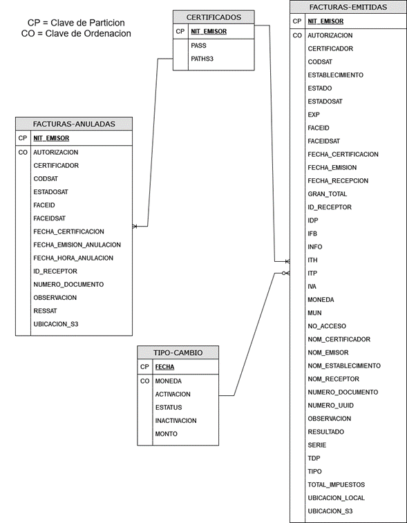

# Tablas 

- [FACTURAS-EMITIDAS](#facturas-emitidas)
- [FACTURAS-ANULADAS](#facturas-anuladas)
- [TIPO-CAMBIO](#tipo-cambio)
- [CERTIFICADOS](#certificados)

# Diagrama

# FACTURAS-EMITIDAS
Tabla en la cual se guardan todos los DTE emitidos por FEL, la mas pesada de todas las tablas.

| NIT\_EMISOR          | STRING | NIT del emisor con el que se realizó el DTE.                                                  |
| -------------------- | ------ | --------------------------------------------------------------------------------------------- |
| AUTORIZACION         | STRING | Concatenación de la fecha en la que certifico el DTE y el identificador único “UUID” del DTE. |
| TIPO                 | STRING | El tipo de DTE realizado.                                                                     |
| RESSAT               | STRING | Respuesta de la SAT después de obtener el DTE.                                                |
| NOM\_EMISOR          | STRING | El nombre del Emisor que realizo el DTE.                                                      |
| RESULTADO            | STRING | Calculado para algunos DTE, no en uso actualmente.                                            |
| MUN                  | STRING | Tasa Municipal del DTE.                                                                       |
| CERTIFICADOR         | STRING | El NIT del certificador autorizado para el DTE.                                               |
| ESTABLECIMIENTO      | STRING | Código del establecimiento certificador.                                                      |
| UBICACION\_S3        | STRING | La ubicación del XML para el DTE emitido en el Bucket “facturas-fel”                          |
| FECHA\_RECEPCION     | STRING | Fecha en la cual se envió el DTE a SAT.                                                       |
| IVA                  | STRING | El IVA calculado del DTE.                                                                     |
| OBSERVACION          | STRING | Observaciones registradas para el DTE.                                                        |
| NOM\_RECEPTOR        | STRING | Nombre del receptor.                                                                          |
| NOM\_CERTIFICADOR    | STRING | Nombre del certificador asignado.                                                             |
| CODSAT               | STRING | Código de respuesta por parte de SAT.                                                         |
| GRAN\_TOTAL          | STRING | Valor total del DTE.                                                                          |
| SERIE                | STRING | Primeros 8 dígitos hexadecimales del UUID del DTE.                                            |
| FECHA\_CERTIFICACION | STRING | Fecha en la cual se certificó el DTE.                                                         |
| ITH                  | STRING | Impuesto al Turismo Hospedaje.                                                                |
| EXP                  | STRING | Contenido de la casilla Exportación.                                                          |
| MONEDA               | STRING | Tipo de moneda utilizada para el DTE.                                                         |
| INFO                 | STRING | Información relevante al DTE.                                                                 |
| NUMERO\_UUID         | STRING | Identificador único del DTE.                                                                  |
| ITP                  | STRING | Impuesto al Turismo Pasajes.                                                                  |
| IFB                  | STRING | Impuesto de Bomberos.                                                                         |
| ESTADOSAT            | STRING | Estado en el cual se encuentra el DTE para la SAT.                                            |
| TOTAL\_IMPUESTOS     | STRING | Suma de impuestos para el DTE.                                                                |
| IDP                  | STRING | Impuesto de Petróleo.                                                                         |
| FACEID               | STRING | Código de régimen FACE para el DTE.                                                           |
| NOM\_ESTABLECIMIENTO | STRING | Nombre del establecimiento certificador.                                                      |
| NO\_ACCESO           | STRING | Numero de acceso asignado para el DTE.                                                        |
| FECHA\_EMISION       | STRING | Fecha en la cual de emitió el DTE.                                                            |
| ESTADO               | STRING | Estado del DTE dentro de FEL.                                                                 |
| ID\_RECEPTOR         | STRING | NIT del receptor o CF.                                                                        |
| UBICACION\_LOCAL     | STRING | Ubicación del DTE on Premise, normalmente NA.                                                 |
| FACEIDSAT            | STRING | Código de régimen FACE del DTE para la SAT.                                                   |
| NUMERO\_DOCUMENTO    | STRING | Equivalente en números decimales a partir de la posición 9 hasta la posición 16 del UUID.     |
| TDP                  | STRING | Impuesto timbre de prensa.                                                                    |

# FACTURAS-ANULADAS
Tabla utilizada para guardar las facturas que se hayan anulado en nuestro FEL.

| NIT\_EMISOR               | STRING | NIT del emisor con el que se realizó el DTE.                                                          |
| ------------------------- | ------ | ----------------------------------------------------------------------------------------------------- |
| AUTORIZACION              | STRING | Concatenación de la fecha en la cual se anuló el DTE y el identificador único “UUID” del DTE.         |
| RESSAT                    | STRING | Respuesta de SAT ante el DTE anulado.                                                                 |
| CERTIFICADOR              | STRING | Certificador que autoriza el DTE.                                                                     |
| ESTADOSAT                 | STRING | Estado en el que se encuentra el DTE para la SAT.                                                     |
| UBICACION\_S3             | STRING | La ubicación del XML para el DTE anulado en el Bucket “facturas-fel”                                  |
| OBSERVACION               | STRING | Razón por la cual se anulo el DTE.                                                                    |
| FACEID                    | STRING | Identificador de régimen FACE para el DTE, este incluye el momento en el cual se inició la anulación. |
| FECHA\_EMISION\_ANULACION | STRING | Fecha en la cual se realizo la solicitud para anular el DTE en FEL.                                   |
| FECHA\_HORA\_ANULACION    | STRING | Fecha en la cual la SAT recibió y valido la anulación del DTE.                                        |
| CODSAT                    | STRING | El código enviado por la SAT como respuesta a la solicitud de anulación.                              |
| ID\_RECEPTOR              | STRING | El NIT del receptor o CF.                                                                             |
| FACEIDSAT                 | STRING | El identificador con el régimen FACE del lado de SAT.                                                 |
| FECHA\_CERTIFICACION      | STRING | Fecha de la certificación del DTE a anular.                                                           |
| NUMERO\_DOCUMENTO         | STRING | Identificador único del DTE.                                                                          |

# TIPO-CAMBIO
Tabla que se sincroniza con el Banco de Guatemala para tener todos los tipos de cambio actuales, de esta forma el DTE realiza cálculos certeros.

| FECHA       | STRING | Fecha en la cual se registró el cambio.         |
| ----------- | ------ | ----------------------------------------------- |
| MONEDA      | STRING | Abreviatura de la moneda.                       |
| MONTO       | STRING | Monto de cambio.                                |
| ESTATUS     | STRING | Estado actual del cambio.                       |
| ACTIVACION  | STRING | Momento en el cual el cambio se toma en cuenta. |
| INACTIVIDAD | STRING | Registro de inactividad del cambio.             |

# CERTIFICADOS
Tabla que almacena los certificados utilizados por FEL, de momento existen 5 certificados.

| NIT\_EMISOR | STRING | El NIT emisor de la certificación.                        |
| ----------- | ------ | --------------------------------------------------------- |
| PASS        | STRING | La contraseña para poder utilizar la certificación.       |
| PATHS3      | STRING | La ubicación del certificado en el Bucket “facturas-fel”. |

