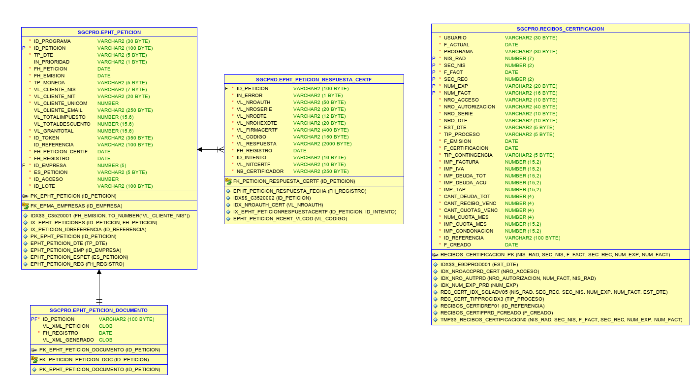

# Diagrama

# Diccionario 

## Estado DTE

| COD   | Descripcion                 |
| ----- | --------------------------- |
| DT001 | PENDIENTE DE CERTIFICAR     |
| DT002 | CERTIFICADO                 |  
| DT003 | CON CONTIGENCIA             |  
| DT005 | EN PROCESO DE CERTIFICACION |

## Tipos de Contigencias

| COD     | Descripcion                                        |
| ------- | -------------------------------------------------- |
| MT001   | FACSITIO FUERA DE ALCANSE                          |
| MT002   | IMPORTE TOTAL NEGATIVO                             |
| MT003   | TIEMPO DE RESPUESTA DEL SERVICIO ACABADO           |
| MT004   | CONTINGENCIAS EXTRAS                               |
| MT005   | REFACTURACION                                      |
| MT006   | NO ENCONTRO REFERENCIA DE FACTURA ORIGINAL         |
| MT007   | NO ENCONTRO REFERENCIA DE FACTURA ORIGINAL         |
| MT111   | EL TOTAL NO COINCIDE CON SGC                       |
| MT112   | EL MONTO DE LA FACTURA ES 0                        |
| MT113   | Numero de acceso incorrecto                        |
| MT114   | No se pudo obtener el total de la factura original |
| MT115   | No se pudo obteener nro de autorizacion antiguo    |
| MT116   | Factura antigua que no debe certificarse           |
| MT117   | Nota de debito no debe certificarse                |
| TDA-215 | Total calculado incorrectamente para el IVA        |
| TDA-222 | Formato de Numero de Serie Incorrecto              |
| TDA-224 | Codigo de referencia repetido ya enviado           |
| MT500   | CONCEPTO NEGATIVO INVALIDO  TEMPORAL               |
| MT644   | IVA Calculado de manera incorrecta                 |
| MT651   | IVA no puede ser mayor al del documento origen     |
| MT697   | Gran Total Mayor al del documento origen           |
| MT737   | Documento Origen no es una factura                 |
| MT739   | ID Receptor no es igual el documento origen        |
| MT999   | SIN CONTIGENCIA                                    |

## Tipos de Procesos
| COD   | Descripcion                          |
| ----- | ------------------------------------ |
| DE001 | FACTURA ONLINE                       |
| DE002 | FACTURA BATCH                        |
| DE003 | SITIO                                |
| DE004 | FACTURA ONLINE EXP                   |
| DE005 | NOTA CREDITO                         |
| DE006 | NOTA DEBITO                          |
| DE007 |  FACTURA EVENTUAL                    |
| DE008 | NOTA CREDITO MET. ANTIG.             |
| DE009 | NOTA CREDITO FACT. OTROS SERV        |
| DE010 | FACTURAS METRONOMO                   |
| DE011 | NC EXPEDIENTES FAC A NO C            |
| DE012 | NC SUMINISTROS EVENTUALES FAC A NO C |
| DE013 |  NC EXP PROSPECTOS FAC A NO C        |
