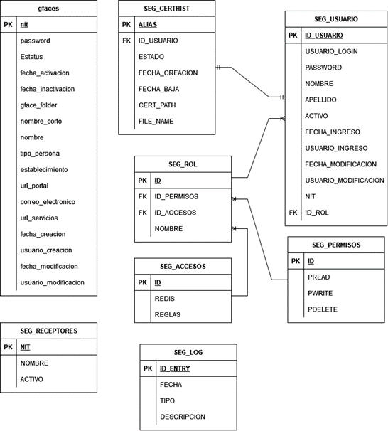

# FEL
Base de datos utilizada para replicar datos de la SAT en el portal. Anteriormente se deseaba utilizar para tener el sistema FEL On Premise, pero se cambio a la nube.

# Tablas

- [gfaces](#gfaces)
- [SEG_ACCESOS](#segaccesos)
- [SEG_CERTHIST](#segcerthist)
- [SEG_LOG](#seglog)
- [SEG_PERMISOS](#segpermisos)
- [SEG_ROL](#segrol)
- [SEG_RECEPTORES](#segreceptores)
- [SEG_USUARIO](#segusuario)

# Entidad Relación

# gfaces
Tabla utilizada para guardar los emisores con el régimen FACE.

| nit                   | Varchar(20) PK | Nit del emisor, se utiliza como llave primaria.   |
| --------------------- | -------------- | ------------------------------------------------- |
| password              | Varchar(100)   | Contraseña del emisor para acceder al Portal FEL. |
| Estatus               | Varchar(45)    | Estado del emisor, A para activo.                 |
| fecha\_activacion     | Datetime       | Fecha en la cual se activó el emisor.             |
| fecha\_inactivacion   | Datetime       | Fecha en la cual se dio de baja al emisor.        |
| gface\_folder         | Varchar(45)    | Ubicación física del emisor.                      |
| nombre\_corto         | Varchar(100)   | Nombre en siglas del Emisor.                      |
| nombre                | Varchar(200)   | Nombre completo del Emisor.                       |
| tipo\_persona         | Int(10)        | Tipo de personería del Emisor.                    |
| establecimiento       | Int(10)        | Código establecimiento del Emisor.                |
| url\_portal           | Varchar(200)   | Url asociado al Emisor.                           |
| correo\_electronico   | Varchar(100)   | Correo electrónico asignado al Emisor.            |
| url\_servicios        | Varchar(200)   | Url para los servicios brindados por el Emisor.   |
| fecha\_creacion       | Datetime       | Fecha en la cual se ingresó el dato en la DB.     |
| usuario\_creacion     | Varchar(10)    | Usuario que ingreso el dato en la DB.             |
| fecha\_modificacion   | Datetime       | Fecha en la cual se edito el dato en la DB.       |
| usuario\_modificacion | Varchar(10)    | Usuario que edito el dato en la DB.               |

# SEG_ACCESOS
Determina los accesos que tienen los usuarios a ciertos datos.

| ID     | Int(11) PK | Id del Acceso.                                |
| ------ | ---------- | --------------------------------------------- |
| REDIS  | Bit(1)     | Permiso para obtener los datos de Redis.      |
| REGLAS | Bit(1)     | Permiso para obtener los datos de las Reglas. |

# SEG_CERTHIST
Mantiene el historial de los certificados utilizados por FEL.

| ID\_USUARIO     | Int(11)        | Nit del certificador.                                      |
| --------------- | -------------- | ---------------------------------------------------------- |
| ALIAS           | Varchar(64) PK | Nombre asignado al certificador para manejar su historial. |
| ESTADO          | Bit(1)         | Booleano para conocer si el certificador esta activo.      |
| FECHA\_CREACION | Datetime       | Fecha de la creación del certificador.                     |
| FECHA\_BAJA     | Datetime       | Fecha en la cual se dio de baja al certificador.           |
| CERT\_PATH      | Varchar(256)   | Ubicación del certificado cifrado.                         |
| FILE\_NAME      | Varchar(128)   | Nombre del certificado.                                    |

# SEG_LOG
Tabla creada para tener un log del sistema.

| ID\_ENTRY   | Int(11) PK   | Identificador del evento guardado. |
| ----------- | ------------ | ---------------------------------- |
| FECHA       | Datetime     | Fecha en la que se dio el evento.  |
| TIPO        | Varchar(20)  | Tipo de evento registrado.         |
| DESCRIPCION | Varchar(512) | Descripción breve del evento.      |

# SEG_PERMISOS
Tabla utilizada para manejar los permisos que tiene un usuario en el sistema por medio de booleanos.

| ID      | Int(11) PK | Identificador del permiso. |
| ------- | ---------- | -------------------------- |
| PREAD   | Bit(1)     | Permiso de lectura.        |
| PWRITE  | Bit(1)     | Permiso de escritura.      |
| PDELETE | Bit(1)     | Permiso de eliminación.    |

# SEG_ROL
Tabla detalle para asociar permisos con accesos en base al Rol que se le asigna a un usuario.

| ID           | Int(11) PK  | Identificador del Rol.                      |
| ------------ | ----------- | ------------------------------------------- |
| ID\_PERMISOS | Int(11)     | Identificador del permiso que tiene el Rol. |
| ID\_ACCESOS  | Int(11)     | Identificador del acceso que tiene el Rol.  |
| NOMBRE       | Varchar(64) | Nombre del Rol.                             |

# SEG_RECEPTORES
Tabla que almacena los receptores registrados en la SAT, esta tabla se actualiza todos los días para tener todos los receptores de la SAT y asociarlos con los DTE.

| NIT    | Varchar(20) PK | Nit del receptor.              |
| ------ | -------------- | ------------------------------ |
| NOMBRE | Varchar(100)   | Nombre del receptor.           |
| ACTIVO | Varchar(20)    | Estado del receptor en la SAT. |

# SEG_USUARIO
Tabla de los usuarios registrados para el uso del Portal FEL.

| ID\_USUARIO           | Int(11) PK   | Identificador del Usuario, regularmente el nit.                    |
| --------------        | ------------ | ------------------------------------------------------------------ |
| USUARIO\_LOGIN        | Varchar(500) | Usuario que se utilizara para iniciar sesión en el portal.         |
| PASSWORD              | Varchar(30)  | Contraseña para el inicio de sesión al portal, no está encriptada. |
| NOMBRE                | Varchar(500) | Nombre del usuario.                                                |
| APELLIDO              | Varchar(100) | Apellido del usuario.                                              |
| ACTIVO                | Bit(1)       | Estado del usuario en el sistema.                                  |
| FECHA\_INGRESO        | Datetime     | Fecha en la cual ingreso el usuario al sistema.                    |
| USUARIO\_INGRESO      | Varchar(30)  | Usuario que ingreso el registro al sistema.                        |
| FECHA\_MODIFICACION   | Datetime     | Fecha en la cual se modifico el usuario en el sistema.             |
| USUARIO\_MODIFICACION | Varchar(30)  | Usuario que modifico el registro en el sistema.                    |
| NIT                   | Varchar(20)  | Nit del usuario.                                                   |
| ID\_ROL               | Int(11) FK   | Rol asociado al usuario.                                           |

